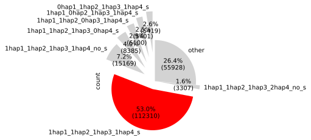

# potato-allelic-orthogroups

Nextflow pipeline to group genes on polyploid phased assemblies that are orthologous and syntelogous based on GENESPACE.

Requirements:

- nextflow

- conda

The following packages are not in bioconda/pip so need to be installed manually:
- McxScan (follow instructions [here](/scratch/nadjafn/potato-allelic-orthogroups/modules/local/genespace/genespace_run/environment.yml) and provide path to installation to --mcscanx_path)
- GENESPACE ([instructions](https://github.com/jtlovell/GENESPACE?tab=readme-ov-file#2-software-installation))(in side the conda env genespace-env (potato-allelic-orthogroups/modules/local/genespace/genespace_run/environment.yml))

minimal input:
- parameter file (params.json)
- genome fasta of phased reference (chromosome names like this: >chr[_]01_1, >chr[_]01_2 Where the _suffix is the haplotype )
- gff with CDS corresponding to the reference (same chromosome names!)

The gff file should look like this https://agat.readthedocs.io/en/latest/gff_to_gtf.html#the-gff-file-to-convert
with the following features:

- gene
- mRNA
- exon
- CDS

The parms.json should look like this
```
{
    "reference_fasta": "genome.fa",
    "reference_gff": "annotation.gff",
    "outdir": "output_path"
}
```

Run like this:
```
nextflow run main.nf -params-file params/params.json \
                     -c cond/nextflow.config \
                     -profile conda \
                     --mcscanx_path [path to MCScanX folder] \
                     -resume
```


## Output

category grouping


### Plots




