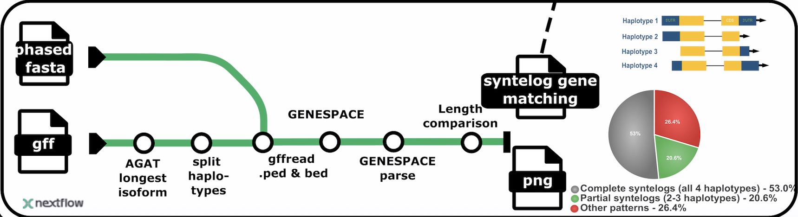

# syntelogfinder

Nextflow pipeline to group genes on polyploid phased assemblies that are orthologous and syntelogous based on GENESPACE results.
This pipeline is part of the [LongPolyASE](https://polyase.readthedocs.io/en/latest/index.html) framework for long-read RNA-seq allele-specific expressin analysis in polyploid organisms. 

## Getting started

Requirements:

- nextflow

- conda

The following packages are not in bioconda/pip so need to be installed manually if running with `--profile conda` (for singularity this is not necessary):
- McxScan (follow instructions [here](https://github.com/wyp1125/MCScanX?tab=readme-ov-file#installation) and provide path to installation to --mcscanx_path)
- GENESPACE ([instructions](https://github.com/jtlovell/GENESPACE?tab=readme-ov-file#2-software-installation))(inside the conda environment genespace-env (syntelogfinder/modules/local/genespace/genespace_run/environment.yml))


### minimal input:
- parameter file (params.json)
- genome fasta of phased reference (chromosome names like this: >chr[_]01_1, >chr[_]01_2 Where the _suffix is the haplotype )
- gff or gtf with CDS corresponding to the reference (same chromosome names!)

The gff file should look like this https://agat.readthedocs.io/en/latest/gff_to_gtf.html#the-gff-file-to-convert
with the following features:

- gene
- mRNA/transcript
- exon
- CDS

Or a gtf file with the following features:

- gene
- mRNA/transcript
- exon
- CDS

Mandatory Attributes

- gene_id - must be present on ALL lines
- transcript_id - required for transcript, exon, CDS features
- Parent - links child features to parent 

The parms.json should look like this
```
{
    "reference_fasta": "genome.fa",
    "reference_gff": "annotation.gff",
    "ploidy": 3,
    "outdir": "output_path"
}
```

Run like this:
```
git clone https://github.com/NIB-SI/syntelogfinder.git

cd syntelogfinder

nextflow run main.nf -params-file params/params.json \
                     -profile singularity \
                     -resume
```

or with conda


```
nextflow run main.nf -params-file params/params.json \
                     -profile singularity \
                     --mcscanx_path [path to McScaX installation]
                     -resume
```
## Test data

A test dataset is available for testing and demonstration purposes. This dataset contains a phased genome assembly and annotation for chromosome 1 across all haplotypes of the tetraploid potato cultivar Atlantic.

- [fasta](https://zenodo.org/records/17590760/files/ATL_v3.asm.chr01_all_haplotypes.fa.gz?download=1&preview=1)
- [gtf](https://zenodo.org/records/17590760/files/ATL_unitato_liftoff.chr01_all_haplotypes.gtf.gz?download=1&preview=1)

Then the `params.json` should look like this:
```json
{
    "reference_fasta": "ATL_v3.asm.chr01_all_haplotypes.fa",
    "reference_gff": "ATL_unitato_liftoff.chr01_all_haplotypes.gtf",
    "ploidy": 4,
    "outdir": "output_path"
}
```

### Tutorial

- [Running syntelogfinder on phased reference of diplpid rice](https://polyase.readthedocs.io/en/latest/tutorial_rice.html)
- [Running syntelogfinder on phased reference of haxaploid wheat](https://polyase.readthedocs.io/en/latest/tutorial.html)


### Output

Here's the formatted sample output for your README:

## Sample Output

The pipeline generates a tab-separated file with the following columns:

| Column | Description |
|--------|-------------|
| `gene_id` | Gene identifier |
| `transcript_id` | Transcript identifier |
| `Synt_id` | Synteny group identifier |
| `synteny_category` | Summary of syntenic gene distribution across haplotypes |
| `syntenic_genes` | Comma-separated list of all syntenic genes |
| `haplotype` | Haplotype assignment |
| `CDS_length_category` | CDS length classification (if applicable) |
| `CDS_haplotype_with_longest_annotation` | Haplotype with the longest CDS annotation (if applicable) |

### Example Output

```tsv
gene_id	transcript_id	Synt_id	synteny_category	syntenic_genes	haplotype	CDS_length_category	CDS_haplotype_with_longest_annotation
TraesAK58CH7A01G122800	TraesAK58CH7A01G122800.1	Synt_id_0	1hapA_3hapB_1hapD_no_s	TraesAK58CH7A01G122800.1,TraesAK58CH1B01G017800.1,TraesAK58CH4B01G024800.1,TraesAK58CH2B01G118200.1,TraesAK58CH2D01G119400.1	hapA
TraesAK58CH1A01G005100	TraesAK58CH1A01G005100.1	Synt_id_1	2hapA_1hapB_2hapD_no_s	TraesAK58CH1A01G005100.1,TraesAK58CH3A01G490400.1,TraesAK58CH1B01G017500.1,TraesAK58CH1D01G000500.1,TraesAK58CH7D01G525700.1	hapA
TraesAK58CH3A01G490400	TraesAK58CH3A01G490400.1	Synt_id_1	2hapA_1hapB_2hapD_no_s	TraesAK58CH1A01G005100.1,TraesAK58CH3A01G490400.1,TraesAK58CH1B01G017500.1,TraesAK58CH1D01G000500.1,TraesAK58CH7D01G525700.1	hapA
TraesAK58CH3A01G236000	TraesAK58CH3A01G236000.1	Synt_id_2	1hapA_1hapB_2hapD_no_s	TraesAK58CH3A01G236000.1,TraesAK58CH1B01G017200.1,TraesAK58CH1D01G000900.1,TraesAK58CH5D01G521100.1	hapA
TraesAK58CH1A01G006000	TraesAK58CH1A01G006000.1	Synt_id_3	3hapA_0hapB_1hapD_no_s	TraesAK58CH1A01G006000.1,TraesAK58CH3A01G436000.1,TraesAK58CH5A01G002300.1,<NA>,TraesAK58CH1D01G365400.1	hapA
TraesAK58CH3A01G436000	TraesAK58CH3A01G436000.1	Synt_id_3	3hapA_0hapB_1hapD_no_s	TraesAK58CH1A01G006000.1,TraesAK58CH3A01G436000.1,TraesAK58CH5A01G002300.1,<NA>,TraesAK58CH1D01G365400.1	hapA
```

**Key Features:**
- Each gene is assigned to a synteny group (`Synt_id`)
- The `synteny_category` shows the distribution pattern (e.g., `2hapA_1hapB_2hapD_no_s` means 2 genes in hapA, 1 in hapB, 2 in hapD, with no specific pattern)
- Missing syntenic genes are indicated with `<NA>`
- All syntenic gene members are listed in the `syntenic_genes` column


### Plots


## Troubleshooting

- if GENESPACE process is interuped, running with -resume flag will fail. To chace the other processes, delete the genespace work dir before resuming
